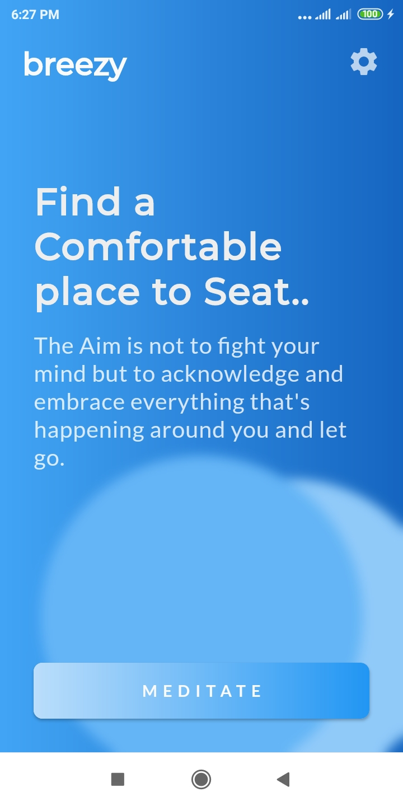
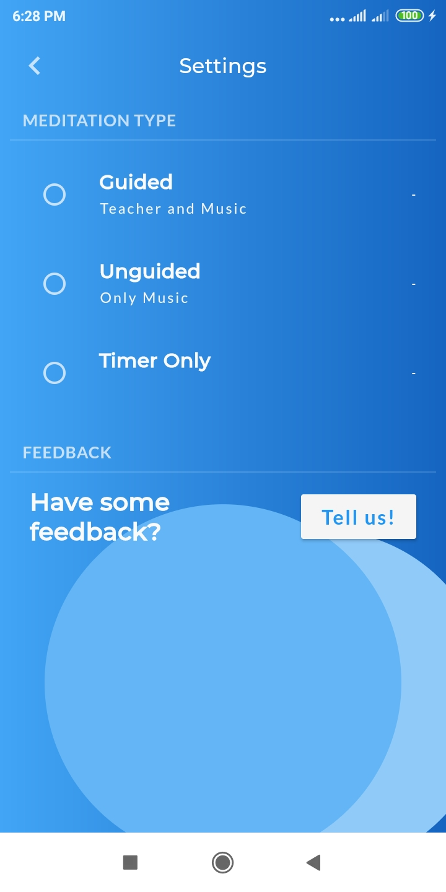
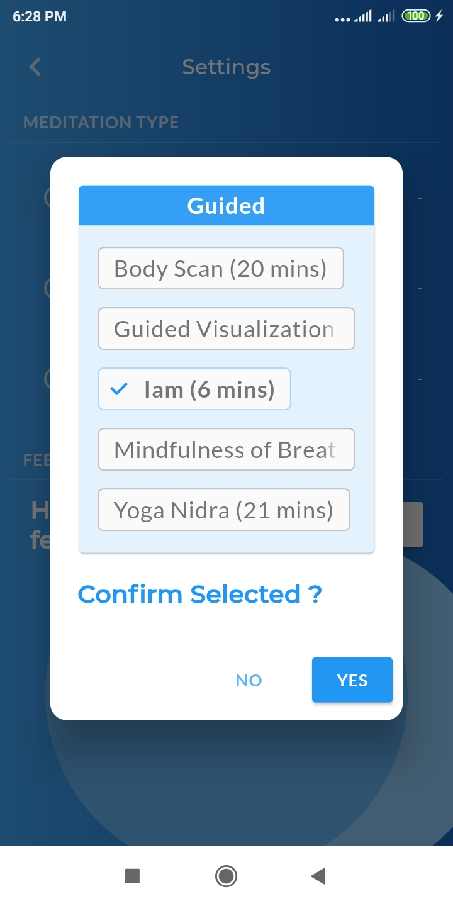
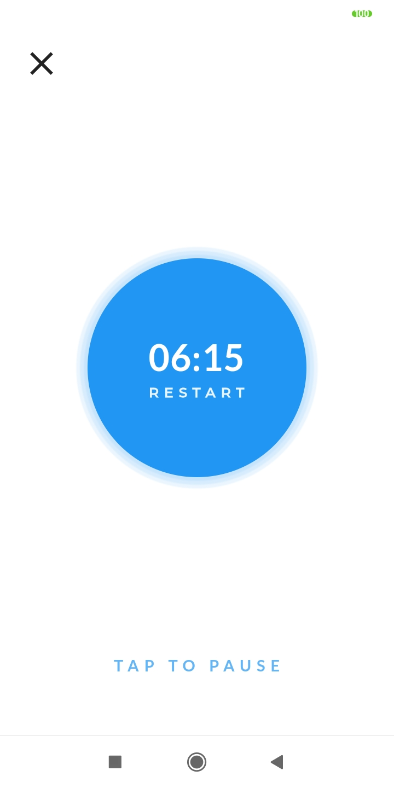

	

<b>It's a simple meditation app, which contains simple breathing routines. There are three kinds of routines, for you to explore, ranging from Guided, Unguided and Timer only.</b>

## Demo
 [Download apk](https://drive.google.com/file/d/10DTVbcVL7UdoG1f1Texcr9eOV6_JMaRY/view?usp=sharing)

## Screenshots
   

## Dependencies

This project is a would not have been possible without following dependencies
- assets_audio_player: ^2.0.13+1
- chips_choice: ^2.0.1
- pausable_timer: ^0.1.0+2
- provider: ^4.3.2+3
- url_launcher: ^5.7.10

## Resources and Licenses

The resources used in this project are free to use commercially and non-commercially. Those are
-  [MIT Medical](https://medical.mit.edu/community/sleep/resources)
-  [Audionautix](https://audionautix.com/)

## License

_Copyright © by Himanshu Nawalkar, grants you an irrevocable, nonexclusive, copyright license to copy, modify and use code from breezy for free, including for commercial purposes, with or without permission or attributing_

#### If you have found this of any value please considering starring this repo or also you can 

